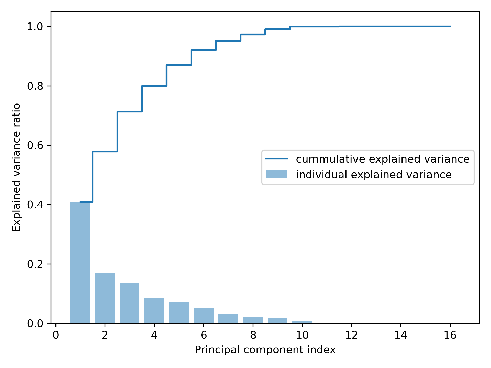
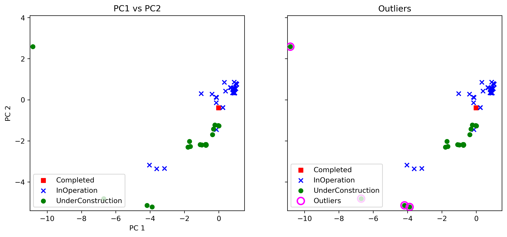

# Green Bond Classification & Outlier Analysis

A modular Python package designed to preprocess environmental bond data, execute Principal Component Analysis (PCA) for dimensionality reduction, filter out structural anomalies, and forecast bond operational states.

## 📁 Project Layout
The application follows a structured, production-grade layout separating codebase modules from raw data inputs:

```text
greenBond/
├── data/
│   └── your_dataset.csv             # Primary green bond dataset
├── src/
│   └── greenBond/
│       ├── __init__.py              # Package initializer
│       ├── __main__.py              # Entry point application script
│       ├── preprocess.py            # Data loading, encoding, & scaling
│       └── pca.py                   # Covariance calculation, PCA, & plotting
├── pca_outliers.png                 # Exported side-by-side analysis plot
└── README.md                        # Documentation
```

---

## 🛠️ Requirements & Installation

This project is built using **Python 3.12** inside an Anaconda environment. 

### Dependencies
Ensure you have the following packages installed in your active environment:
* `numpy`
* `pandas`
* `scikit-learn`
* `matplotlib`
* `seaborn`

## Execution Guide

To ensure that modular files (such as `pca.py` and `preprocess.py`) track relative variables smoothly without triggering caching or import path issues, run the package as a module directly from your terminal or your Spyder IPython console.

### Running from the Console
Navigate your current working directory to the root `greenBond/` folder and execute:
```python
%run -m greenBond
```

### Running from Terminal
```bash
python -m src.greenBond
```

---

## Pipeline Overview

1. **Preprocessing (`preprocess.py`)**: 
   * Reads raw source variables dynamically using `pathlib`.
   * Maps qualitative targets (`Completed`, `InOperation`, `UnderConstruction`) into numeric values using `LabelEncoder`.
   * Standardizes numerical attributes via `StandardScaler` to prevent high-magnitude features from skewing structural weight calculations.
2. **Dimensionality Reduction & Anomaly Tracking (`pca.py`)**:
   * Generates a structural features covariance matrix.
   * Extracts system eigenvalues and eigenvectors using `np.linalg.eigh`.
   * Projects components onto a side-by-side comparison layout mapping structural data variation versus extreme distance anomalies (95th percentile tracking).
3. **Forecasting Model**:


## Scree Plot


## PC1 vs PC2 and Outliers
When successfully executed, the script exports a high-resolution analysis chart named `pca_outliers.png` which isolates structural variation layouts against anomalous spatial data points:



